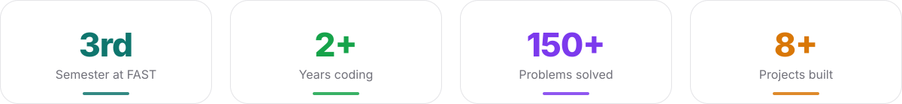
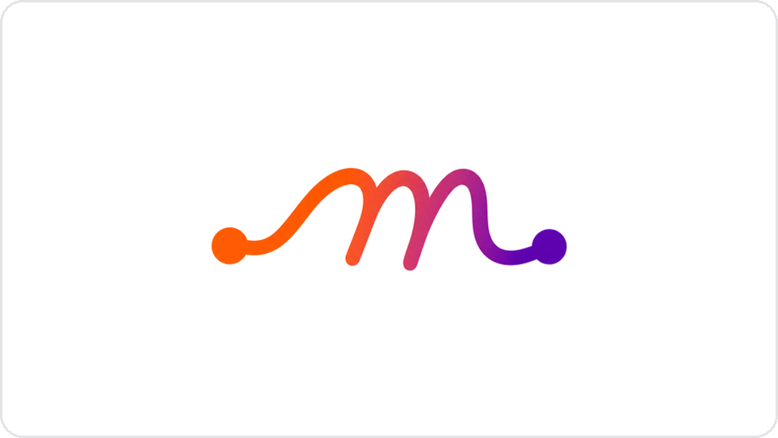
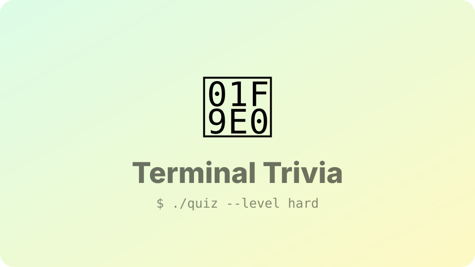
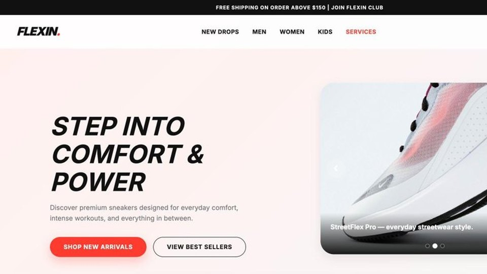
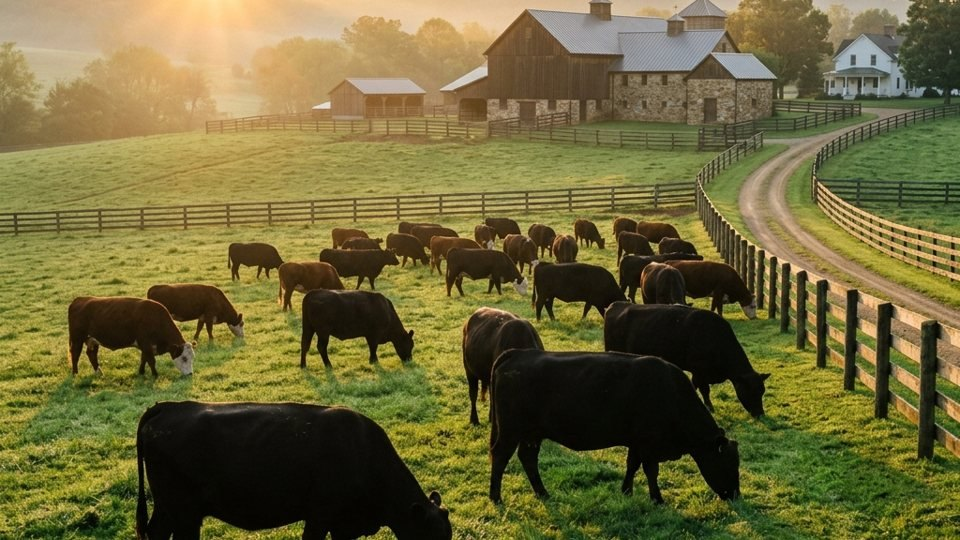

 

## About me

I'm Ubaid, a Computer Science student at **FAST University** and the founder of **[Mealopia](https://mealopia.com)**.
I'm building strong fundamentals in data structures & algorithms, OOP and how computers work under the hood (DLD and COAL),
while getting hands-on with backend development using Node.js and Firebase. I also enjoy working with AI tools like Claude
to sharpen my prompt engineering, and I learn best by building real projects.

Chiniot, Pakistan &nbsp;·&nbsp; BSCS, FAST NUCES (2025 – 2029) &nbsp;·&nbsp; Founder @ Mealopia

## Projects

<table>
  <tr>
    <td width="50%" valign="top">
      
      <h3>Mealopia &nbsp; </h3>
      My food &amp; grocery delivery startup, live in Chiniot. Four Flutter apps (Customer, Restaurant, Rider, Admin) running on a Firebase and Cloud Functions backend.
        
      <code>Flutter</code> <code>Firebase</code> <code>Cloud Functions</code> <code>Node.js</code>
        
      <a href="https://mealopia.com"><b>Website ↗</b></a> &nbsp;·&nbsp; <a href="https://play.google.com/store/apps/details?id=com.mealopia.app"><b>Google Play ↗</b></a>
      

        
<b>What I built</b>

         
        <ul>
          <li><b>Event-driven backend</b> on Cloud Functions: order notifications, a rider-matching engine that ranks nearby riders fairly, and scheduled jobs that re-offer stale orders.</li>
          <li><b>Server-side money logic</b>: delivery fees, commissions, payouts and rider cash settlement as unit-tested modules with transactional, idempotent writes and audit logs.</li>
          <li><b>Secure by default</b>: deny-by-default Firestore rules and role-based admin access.</li>
          <li><b>Real-time</b> order status and push notifications (FCM), plus an admin panel for orders, riders, payouts and the cash ledger.</li>
        </ul>
      

    </td>
    <td width="50%" valign="top">
      
      <h3>C++ Quiz Game &nbsp;</h3>
      A console trivia game with 5 categories, 3 difficulty levels, a 10-second timer, lifelines and a 2-player mode. Built in a team of three.
        
      <code>C++</code> <code>File Handling</code> <code>Sorting</code> <code>Team of 3</code>
        
      <a href="https://github.com/ubaidafzal01/QUIZ-GAME-IN-CPP"><b>Code ↗</b></a>
      

        
<b>My part</b>

         
        <ul>
          <li><b>Leaderboard</b>: loads scores from file, sorts them and shows the top 5.</li>
          <li><b>Admin mode</b> for adding new questions to the question files.</li>
          <li><b>Game review</b> showing every question, your answer and the correct one.</li>
          <li><b>Activity log</b> that records each game automatically.</li>
        </ul>
      

    </td>
  </tr>
  <tr>
    <td width="50%" valign="top">
      
      <h3>Flexin: Shoe Brand Website &nbsp;</h3>
      A multi-page, responsive shoe store with Men, Women and Kids collections, a hero image slider, a mobile menu and a dark/light theme.
        
      <code>HTML</code> <code>CSS</code> <code>JavaScript</code> <code>Responsive</code>
        
      <a href="https://github.com/ubaidafzal01/FLEXIN-SHOE-BRAND-WEBSITE-FINAL-PROJECT-ICT"><b>Code ↗</b></a>
    </td>
    <td width="50%" valign="top">
      
      <h3>Laham Cattle Farm &nbsp;</h3>
      A showcase website for a local cattle farm, presenting their Qurbani animals and premium meat supply, with a gallery, a location map and a contact form.
        
      <code>Next.js</code> <code>TypeScript</code> <code>Tailwind</code> <code>Framer Motion</code>
        
      <a href="https://github.com/ubaidafzal01/Laham-cattle-farm.com"><b>Code ↗</b></a>
    </td>
  </tr>
</table>

## Skills

**Core CS:** Data Structures &amp; Algorithms · OOP · Digital Logic Design (DLD) · Computer Organization &amp; Assembly Language (COAL) · REST APIs 
**I speak:** English · Urdu · Punjabi

## What I'm working towards

I'm following my own six-semester plan to become an **AI-native backend systems engineer**:
Java, Spring Boot, databases, distributed systems, cloud and AI-assisted engineering.

| Sem | Focus | Final project |
| :-: | --- | --- |
| **03** ← *now* | Java + Git + OOP | Build Your Own Redis in Java |
| **04** | Spring Boot + SQL | Write a Database from Scratch |
| **05** | Security + Cloud + DevOps | Build Your Own Private Search Engine |
| **06** | Microservices + Kafka | Event-Driven Payment Microservices |
| **07** | System Design + AI Agents | Scalable URL Shortener |
| **08** | Interviews + Capstone | Production-Grade Distributed Redis |

→ **[See the full roadmap with learning resources](https://ubaidafzal01.github.io/Ai-native-backend-roadmap/)**

## Outside of code

**Gaming**: my favourite way to unwind after a long day of classes and code. 
**Travelling**: exploring new cities and places whenever I get the chance. 
**Coding**: yes, even for fun: side projects, experiments and late-night problem solving.

## Contributions

<picture>
  <source media="(prefers-color-scheme: dark)" srcset="https://raw.githubusercontent.com/ubaidafzal01/ubaidafzal01/output/github-snake-dark.svg" />
  
</picture>

## Let's connect

**[ubaidafzal117@gmail.com](mailto:ubaidafzal117@gmail.com)** &nbsp;·&nbsp; **[LinkedIn](https://www.linkedin.com/in/ubaid-afzal-06483137b/)** &nbsp;·&nbsp; **[WhatsApp](https://wa.me/923097894707)** &nbsp;·&nbsp; **[Portfolio](https://ubaidafzal01.github.io/Ubaid-Afzal/)**

